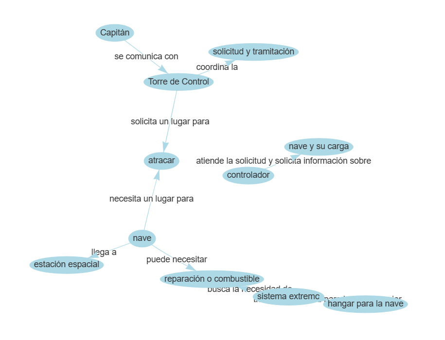

# Innovahack
## Equipo Fantásticos

Presentamos un demostrador de Ágora, nuestra solución para reducir el Time-to-Market (TTM) en la fase técnica del cliclo de vida de los proyectos.

Nuestra solución consiste en integrar varias herramientas que usamos en CaixaBank Tech, para acelerar en todas las fases relacionadas de proyecto. 

Consideraciones:
- El código se ha realizado completamente durante el día de la hackathon
- Se ha utilizado Streamlit para facilitar el prototipado (con sus cosillas, como nombrar files de python con emoticonos...)
- Esto es claramente un MVP
- Para un escalado, se usarían técnicas de RAG (retrieval-augmented generation) más sofisticadas

## Cómo empezar usar
- Instala las dependencias (de requirements.txt) con 'pip install -r requirements.txt'
- Necesitas un deployment de OpenAI, e identificar las claves de conexión
- Asímismo, para "crea un chatbot", necesitas un usuario, contraseña y link a un confluence

### Cómo usar la función de esquematizar reuniones
Basta con que añadas un .txt de una transcripción de una reunión, o conversación entre compañeros. Se adjuntan ejemplos en la carpeta "ejemplos_conversaciones".
Como output, se hará el display de un esquema interactivo.
Esta funcionalidad puede ser muy útil para representar, visual y esquemáticamente, una componente o problema discutido en una reunión con varias personas.

